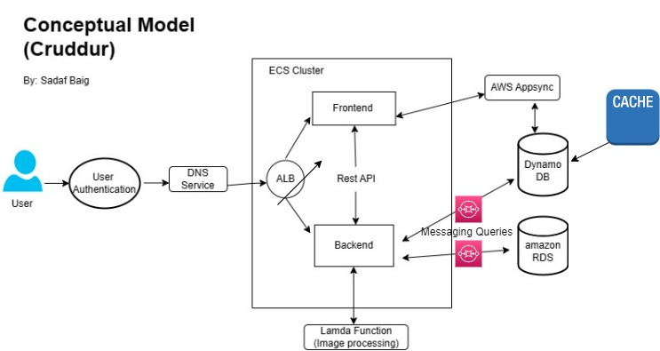
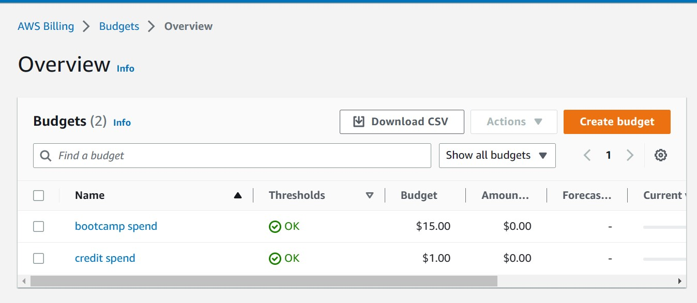
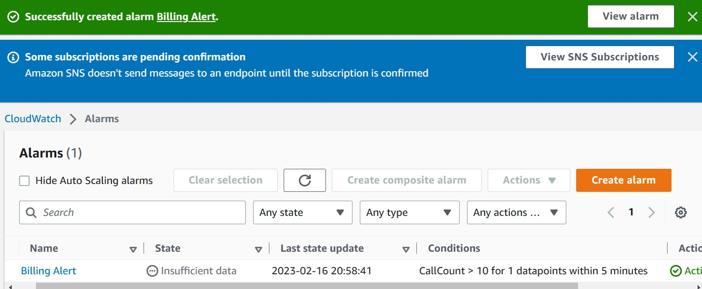
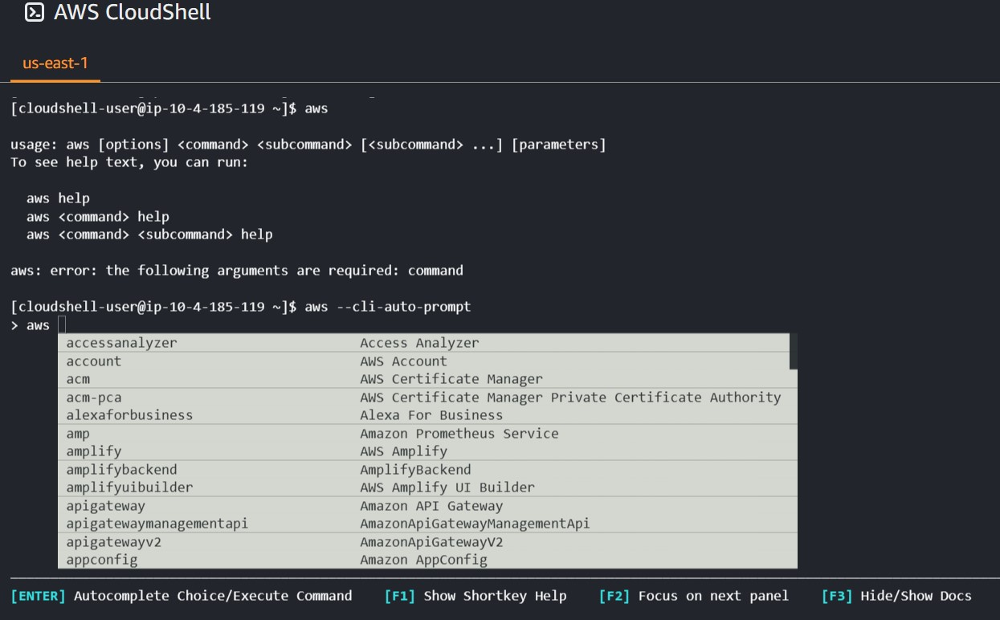
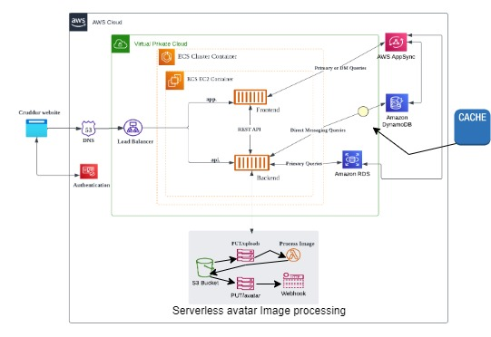

# Week 0 — Billing and Architecture

## Task 1

Performed Sucessfully: Created an IAM user enabled MFA on Root account and IAM user.Set permissions for an IAM user.Created the AWS Credential and installed AWS CLI on gitpod.
(gitpod.yaml)

## Task 2

Here is the image of the Cruddur conceptual diagram created through draw.io.Reason in free trial of lucid chart ran out of shapes.

## Task 3
Screenshot of Budgets,Set two Budgets on AWS Console,one for the Cost and another for the Credit spend.

## Task 4
Screenshot of Billing alarm.Set Billing Alert on AWS Console

## Task 5

Run commands on AWS Cloudeshell here is the screenshot.

## Task 6

Here is the link of Logical Diagram of Cruddur from lucid chart.
https://lucid.app/lucidchart/9b723750-aeae-4b57-aefe-68595e906230/edit?viewport_loc=351%2C100%2C1304%2C617%2C0_0&invitationId=inv_a9e0bc1e-c3a9-4346-bc87-0bc9ac2812ab

So,in free trial of lucid chart, I ran out of shapes so wasnot able to continue, half diagram created through draw.io.I am adding the image of complete diagram here which I created.

