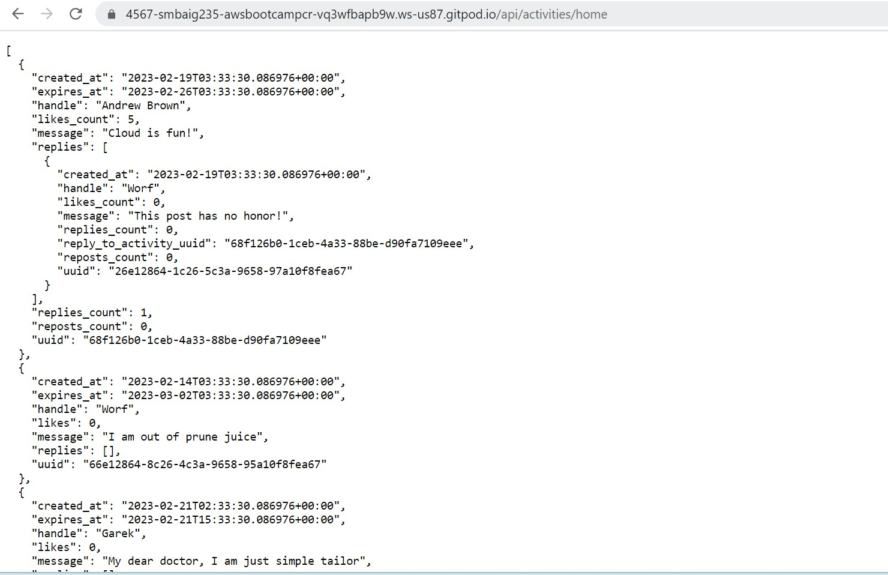

# Week 1 — App Containerization

## Task 1: Create a Docker file on bakend-flask

Copy and paste this code in the docker file

## Code: 

FROM python:3.10-slim-buster
WORKDIR /backend-flask
COPY requirements.txt requirements.txt
RUN pip3 install -r requirements.txt
COPY . .
ENV FLASK_ENV=development
EXPOSE ${PORT}
CMD [ "python3", "-m" , "flask", "run", "--host=0.0.0.0", "--port=4567"]
------------------------------------------------------------------------------------------------
## On the terminal Run:
⦁	pip3 install -r requirements.txt
It will install the python libraries use for the app.
CMD:
⦁	python3 -m flask run --host=0.0.0.0 --port=4567

Now make sure the backend port(4567) is unlock then click on the link and add these suffix at the end of the URL: /api/activities/home
now new backend URL will be like this:
https://4567-smbaig235-awsbootcampcr-vq3wfbapb9w.ws-us87.gitpod.io/api/activities/home 

