# Week 2 — Distributed Tracing
## Task 1: HoneyComb
Honeycomb is a fast analysis tool that reveals how your code is experienced in complex and unpredictable environments. 

### Step 1: Export HoneyComb API key:
`export HONEYCOMB_API_KEY="eTyV1LuefkWNs7PkN4FVCY"`
`gp env HONEYCOMB_API_KEY="eTyV1LuefkWNs7PkN4FVCY"`
Also export HoneyComb service:
`export HONEYCOMB_SERVICE_NAME="Cruddur"`
`gp env HONEYCOMB_SERVICE_NAME="Cruddur"`
### Step 2:  Add these OTEL in docker compose-yaml file
Honeycomb supports OpenTelemetry, the CNCF open standard for sending traces, metrics, and logs.
```
OTEL_SERVICE_NAME: 'Backend-flask'
OTEL_EXPORTER_OTLP_ENDPOINT: "https://api.honeycomb.io"
OTEL_EXPORTER_OTLP_HEADERS: "x-honeycomb-team=${HONEYCOMB_API_KEY}"
```
### Step 3: add this flask in requirements.txt
```
flask
flask-cors
pip install opentelemetry-api \
    opentelemetry-sdk \
    opentelemetry-exporter-otlp-proto-http \
    opentelemetry-instrumentation-flask \
    opentelemetry-instrumentation-requests
```
### Step 4: Now cd into backend-flask directory and install the above requirements on the terminal.
`pip install -r requirements.txt`
### Step 5: Instrument HoneyComb
```
# Honeycomb
from opentelemetry import trace
from opentelemetry.instrumentation.flask import FlaskInstrumentor
from opentelemetry.instrumentation.requests import RequestsInstrumentor
from opentelemetry.exporter.otlp.proto.http.trace_exporter import OTLPSpanExporter
from opentelemetry.sdk.trace import TracerProvider
from opentelemetry.sdk.trace.export import BatchSpanProcessor
from opentelemetry.sdk.trace.export import ConsoleSpanExporter, SimpleSpanProcessor
```
# Honeycomb
```
# Initialize tracing and an exporter that can send data to Honeycomb
provider = TracerProvider()
processor = BatchSpanProcessor(OTLPSpanExporter())
provider.add_span_processor(processor)
```
```
# show this in the logs with in the backend flask app (STDOUT)
simple_processor = SimpleSpanProcessor(ConsoleSpanExporter())
provider.add_span_processor(simple_processor)

trace.set_tracer_provider(provider)
tracer = trace.get_tracer(__name__)
```
```
# Initialize automatic instrumentation with Flask
app = Flask(__name__)
# Honeycomb
# Initialize automatic instrumentation with Flask
FlaskInstrumentor().instrument_app(app)
RequestsInstrumentor().instrument()
```
### Step 6: Add the Environment variable to backend flask in compose.yaml file
```
OTEL_EXPORTER_OTLP_ENDPOINT: "https://api.honeycomb.io"
OTEL_EXPORTER_OTLP_HEADERS: "x-honeycomb-team=${HONEYCOMB_API_KEY}"
OTEL_SERVICE_NAME: "${HONEYCOMB_SERVICE_NAME}"
```
### Step 7:  To add span and attributes open file in bakend-flask "home_activities.py" 
`from opentelemetry import trace`
`tracer = trace.get_tracer("home.activities")`
```
class HomeActivities:
  def run(logger):
   logger.info("Home Activities")
   with tracer.start_as_current_span("home-activies-mock-data"):
    span = trace.get_current_span()
    now = datetime.now(timezone.utc).astimezone()
    span.set_attribute("app.now", now.isoformat())
```
Now Commit and synchronize  then `compose up`
Open backend page and send some data to honeycomb.io and observe the traces and run different queries to observe.
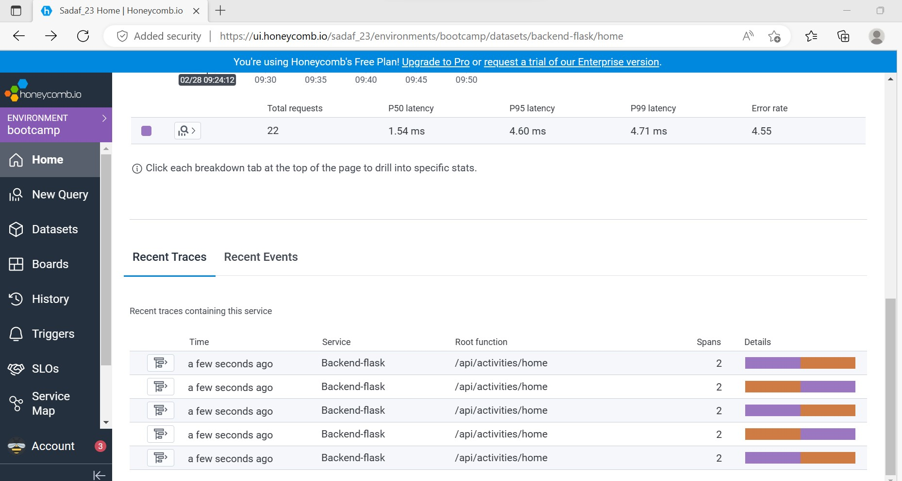
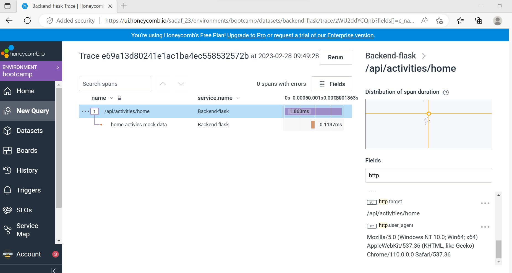


##Custom Queries: 
### Query 1: 
```
VISUALIZE: AVG(duration_ms) GROUP BY: http.status_code ORDER BY: AVG(duration_ms)desc
```
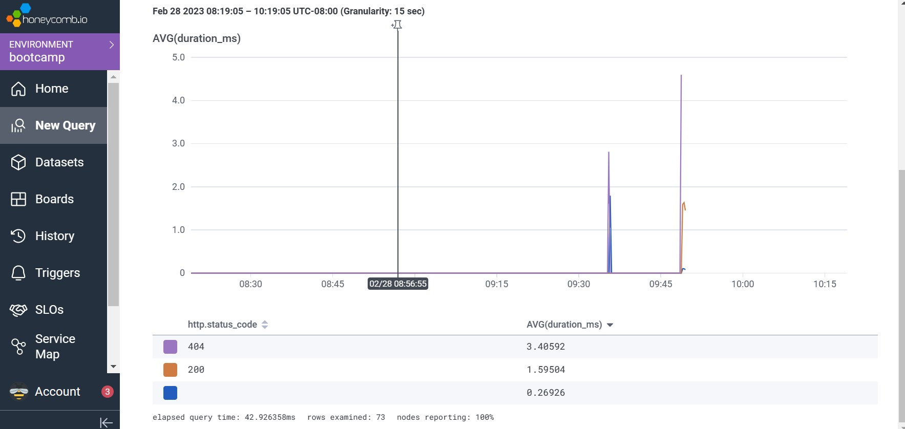
### Query 2: 
`VISUALIZE: COUNT WHERE: app.result_length ORDER BY: trace.trace_id`
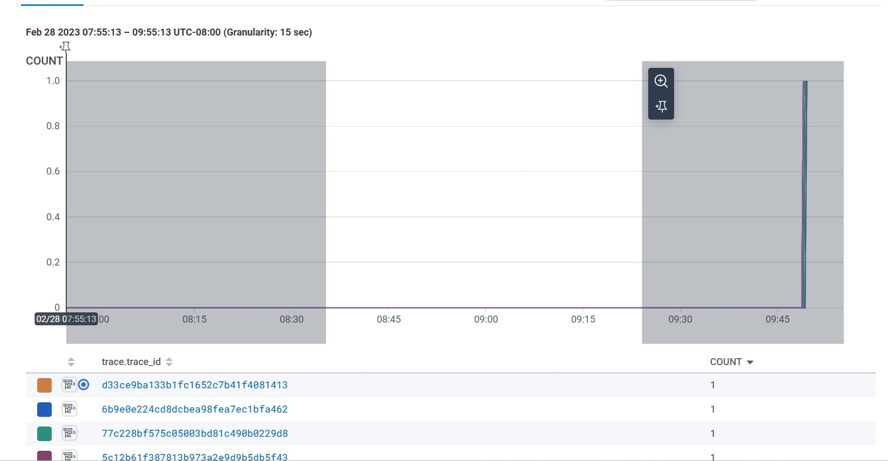
### Query 3: 
```
VISUALIZE: COUNT_DISTINCT(http.server_name) GROUP BY: duration_ms ORDER BY: COUNT_DISTINCT(http.server_name) desc
```
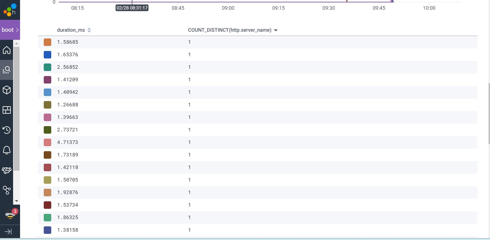

### Saved queries:

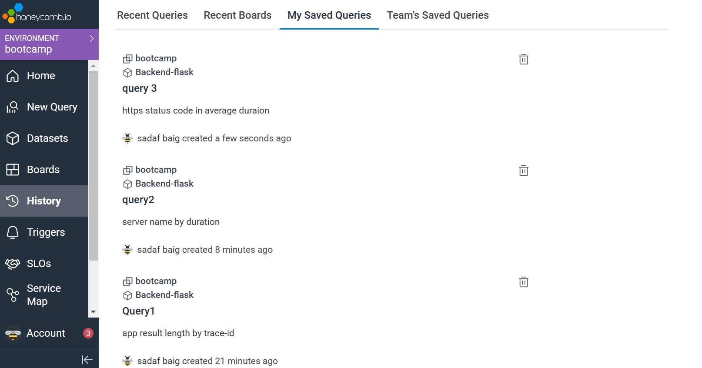

## Task 2: Instrument AWS X-Ray 
AWS X-Ray is a service that collects data about requests that your application serves, and provides tools that you can use to view, filter, and gain insights into that data to identify issues.
### Step 1: Add this aws x-ray sdk in " requirements.txt" file
`aws-xray-sdk`
### Step 2: Now install the pythondependies requiremnts.
`pip install -r requirements.txt`
### Step 3: Instrument X-Ray: Add the following code in App.py
```
from aws_xray_sdk.core import xray_recorder
from aws_xray_sdk.ext.flask.middleware import XRayMiddleware
```
```
xray_url = os.getenv("AWS_XRAY_URL")
xray_recorder.configure(service='Cruddur', dynamic_naming=xray_url)
```
```
XRayMiddleware(app, xray_recorder)
```
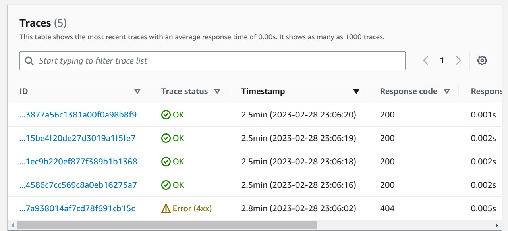
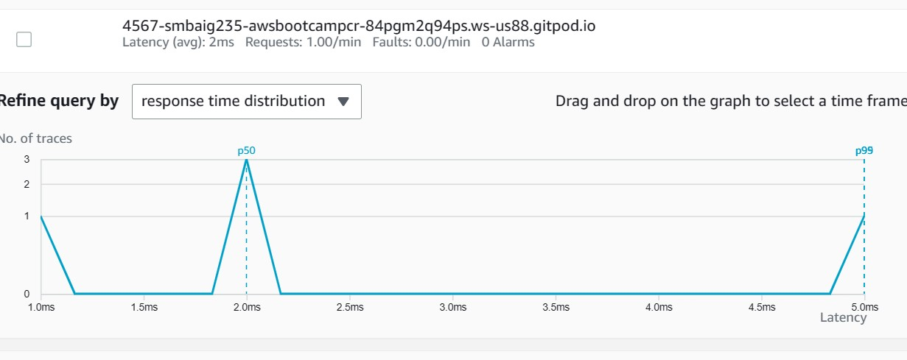


### Step 4: Now create a folder in the root directory:"aws/json" & add a file "xray.json" paste this code.
```
{
    "SamplingRule": {
        "RuleName": "Cruddur",
        "ResourceARN": "*",
        "Priority": 9000,
        "FixedRate": 0.1,
        "ReservoirSize": 5,
        "ServiceName": "backend-flask",
        "ServiceType": "*",
        "Host": "*",
        "HTTPMethod": "*",
        "URLPath": "*",
        "Version": 1
    }
  }
  ```
### Step 5: To create group on AWS X-Ray.cd into backend-flask directory and run these commands.
```
aws xray create-group \
   --group-name "Cruddur" \
   --filter-expression "service(\"backend-flask\")"
```
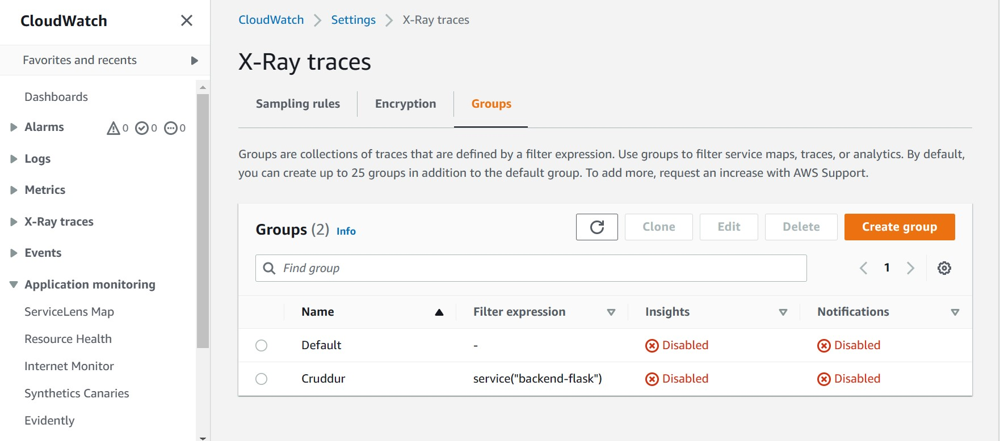

### Step 6: On the same directory backend-flask.Create sample rule
`aws xray create-sampling-rule --cli-input-json file://aws/json/xray.json`
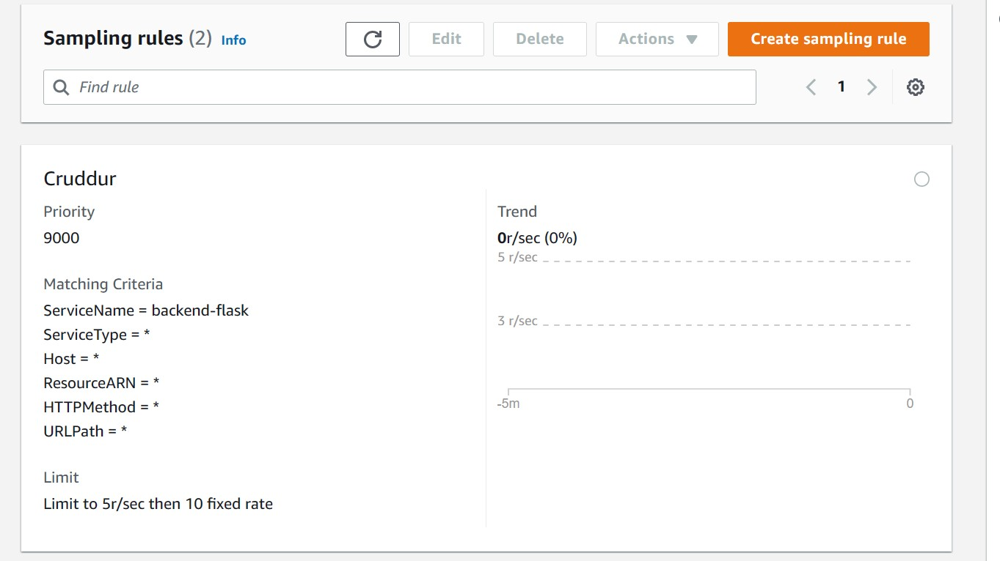

### Step 7: Add this code in "compose.yaml" file 
```
AWS_XRAY_URL: "*4567-${GITPOD_WORKSPACE_ID}.${GITPOD_WORKSPACE_CLUSTER_HOST}*"
      AWS_XRAY_DAEMON_ADDRESS: "xray-daemon:2000"
```
```
xray-daemon:
    image: "amazon/aws-xray-daemon"
    environment:
      AWS_ACCESS_KEY_ID: "${AWS_ACCESS_KEY_ID}"
      AWS_SECRET_ACCESS_KEY: "${AWS_SECRET_ACCESS_KEY}"
      AWS_REGION: "us-west-1"                           
    command:
      - "xray -o -b xray-daemon:2000"
    ports:
      - 2000:2000/udp
```
Now commit and synchronize all the changes and `compose up`. after that make sure our daemon container shows this message"sucessfully sent batch of 1 segement".Open AWS Console and observe the traces.
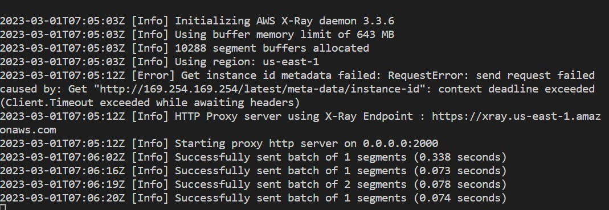
### Step 8: Add the following code to create custom segment and subsegment.Now open "backend-flask/services/user_activities.py".
`from aws_xray_sdk.core import xray_recorder`
```
class UserActivities:
  def run(user_handle):
    try: 
      segment = xray_recorder.begin_segment('user_activities_start')
```
```
      subsegment = xray_recorder.begin_subsegment('mock-data')

      dict = {

       "now": now.isoformat(),
       "result-size": len(model['data'])
      }
      segment.put_metadata('key', dict, 'namespace')
      subsegment.put_annotation('key', 'value')
      xray_recorder.end_subsegment()
    finally:
      # Close the segment
      xray_recorder.end_segment()

      return model
```
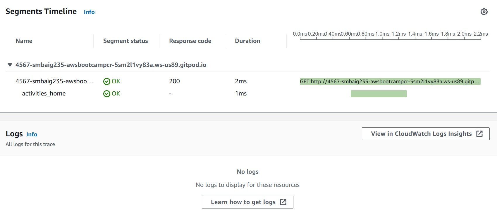
### Step 9: For the subsegment open "app.py" under bakcend-flask directory and add  this code to capture user activities.
```
@app.route("/api/activities/home", methods=['GET'])
@xray_recorder.capture('activities_home')
def data_home():
  data = HomeActivities.run(logger=LOGGER)
  return data, 200
```
```
@app.route("/api/activities/@<string:handle>", methods=['GET'])
@xray_recorder.capture('activities_user')
def data_handle(handle):
  model = UserActivities.run(handle)
  if model['errors'] is not None:
    return model['errors'], 422
  else:
    return model['data'], 200
```

## Task 3:Configure CloudWatch logs
The Amazon CloudWatch Logs service allows you to collect and store logs from your resources, applications, and services in near real time.

### Step 1: Open file "requirements.txt" add.
`watchtower`
### Step 2: Now cd into backend-flask directory and run the requirements.
`pip install -r requirements.txt`
### Step 3: Open app.py file add the following code.
```
import watchtower
import logging
from time import strftime
```
```
# Configuring Logger to Use CloudWatch
LOGGER = logging.getLogger(__name__)
LOGGER.setLevel(logging.DEBUG)
console_handler = logging.StreamHandler()
cw_handler = watchtower.CloudWatchLogHandler(log_group='cruddur')
LOGGER.addHandler(console_handler)
LOGGER.addHandler(cw_handler)
LOGGER.info("test log")
```
```
@app.after_request
def after_request(response):
    timestamp = strftime('[%Y-%b-%d %H:%M]')
    LOGGER.error('%s %s %s %s %s %s', timestamp, request.remote_addr, request.method, request.scheme, request.full_path, response.status)
    return response
```
```
@app.route("/api/activities/home", methods=['GET'])
def data_home():
  data = HomeActivities.run(logger=LOGGER)
  return data, 200
```
### Step 4: Goto file "home_activities.py" add the following code for logger.

```
class HomeActivities:
  def run(logger):
   logger.info("Home Activities")
```
### Step 5: Add environment variable in docker compose file:
```
AWS_DEFAULT_REGION: "${AWS_DEFAULT_REGION}"
AWS_ACCESS_KEY_ID: "${AWS_ACCESS_KEY_ID}"
 AWS_SECRET_ACCESS_KEY: "${AWS_SECRET_ACCESS_KEY}"
```
Now Commit all the changes & compose up the docker compose file.Then send some logs to AWS CloudWatch logs to observe the log events.

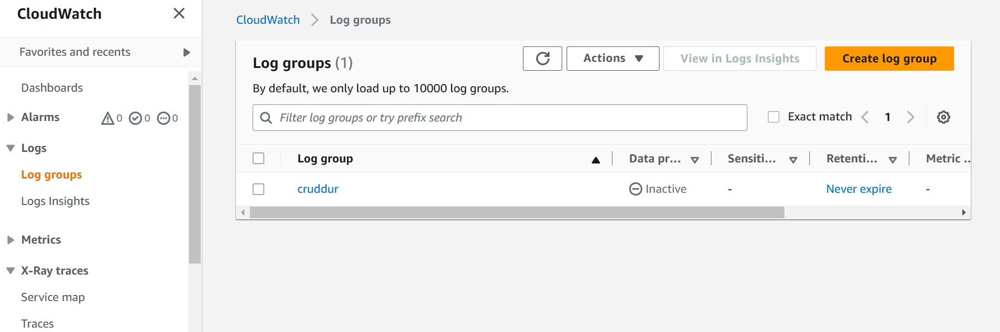
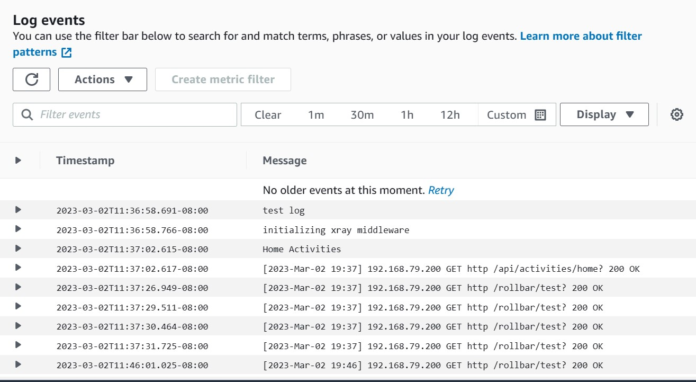

## Task 4: Integrate Rollbar with Cruddur app.
  Rollbar gives you a real-time feed of all errors .
### Step 1: open requirements.txt and add these requirements.
`blinker`
`rollbar`
now run the requirements:  `pip install -r requirements.txt`

### Step 2: Open compose.yaml file set the access token.
'ROLLBAR_ACCESS_TOKEN: "${ROLLBAR_ACCESS_TOKEN}"'

### Step 3: Now export the access token through CLI.

`export ROLLBAR_ACCESS_TOKEN="de543e3610044146861616f5c204a151"`
`gp env ROLLBAR_ACCESS_TOKEN="de543e3610044146861616f5c204a151"`

### Step 4: Add the following code in "app.py" file in nabkend-flask directory.
```
import rollbar
import rollbar.contrib.flask
from flask import got_request_exception
```
```
rollbar_access_token = os.getenv('ROLLBAR_ACCESS_TOKEN')
@app.before_first_request
def init_rollbar():
    """init rollbar module"""
    rollbar.init(
        # access token
        rollbar_access_token,
        # environment name
        'production',
        # server root directory, makes tracebacks prettier
        root=os.path.dirname(os.path.realpath(__file__)),
        # flask already sets up logging
        allow_logging_basic_config=False)

    # send exceptions from `app` to rollbar, using flask's signal system.
    got_request_exception.connect(rollbar.contrib.flask.report_exception, app)
 ```
```
#add an endpoint for testing
@app.route('/rollbar/test')
def rollbar_test():
    rollbar.report_message('Hello World!', 'warning')
    return "Hello World!"
```
Last Step: `Compose up` now test the backend page with the suffix "/rollbar/test"
then observe the events on rollbar.
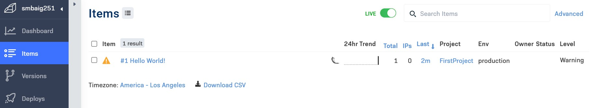

