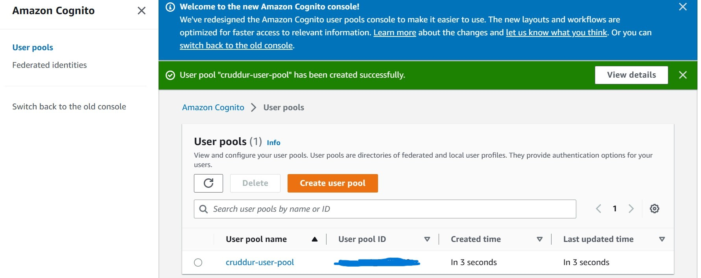
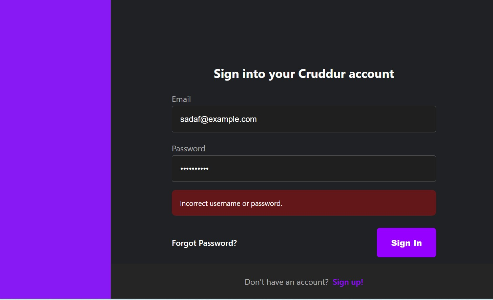
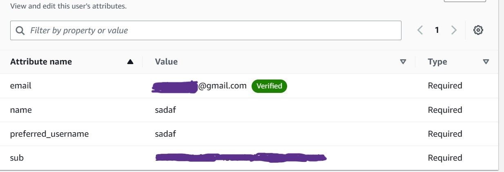
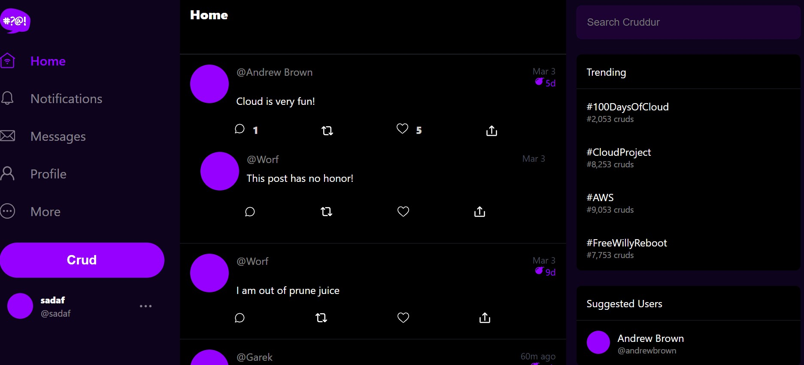
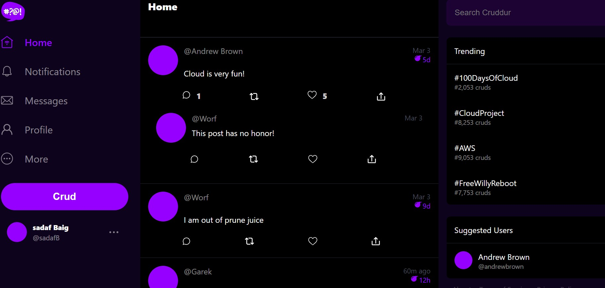
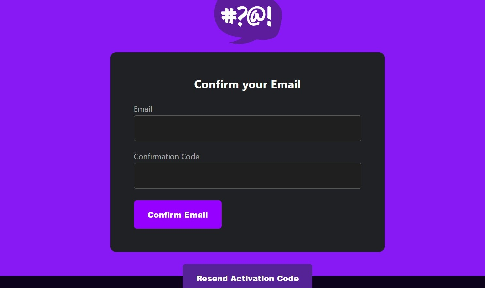
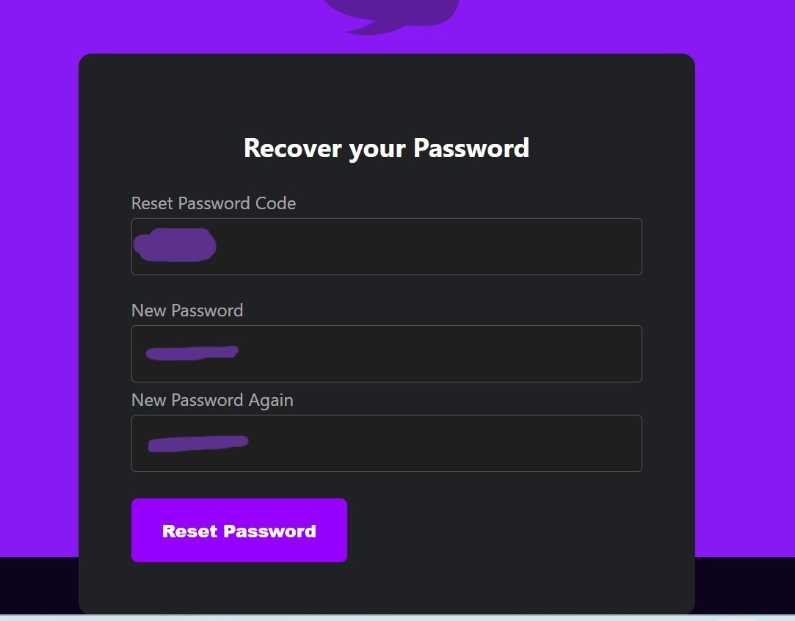
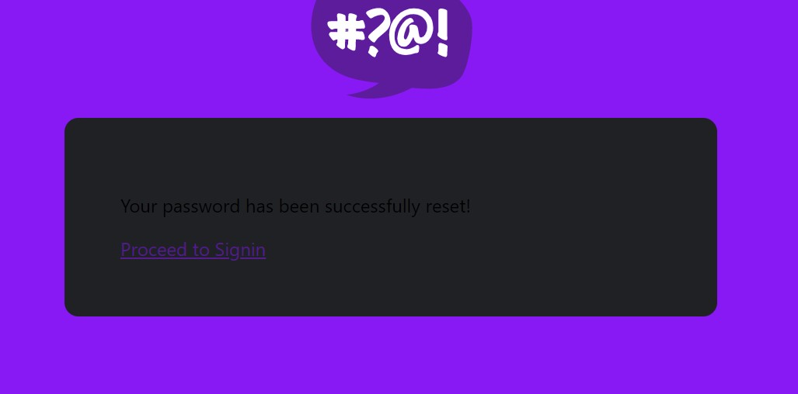
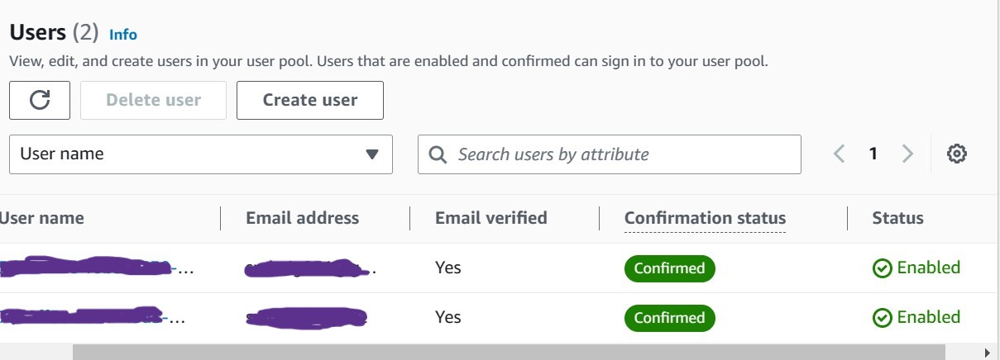

# Week 3 — Decentralized Authentication
## Task 1: Create an AWS Cognito User Pool for user group through AWS Console.

## Task 2: Install & configure amplify client side library.
### Step 1: Make sure to change directory into frontend-react-js then run this command:
`npm i aws-amplify --save`
### Step 2: To configure amplify open frontend-react-js/app.py file & add the following code.
```
import { Amplify } from 'aws-amplify';

Amplify.configure({
  "AWS_PROJECT_REGION": process.env.REACT_APP_AWS_PROJECT_REGION,
  "aws_cognito_region": process.env.REACT_APP_AWS_COGNITO_REGION,
  "aws_user_pools_id": process.env.REACT_APP_AWS_USER_POOLS_ID,
  "aws_user_pools_web_client_id": process.env.REACT_APP_CLIENT_ID,
  "oauth": {},
  Auth: {
    region: process.env.REACT_APP_AWS_PROJECT_REGION,           
    userPoolId: process.env.REACT_APP_AWS_USER_POOLS_ID,        
    userPoolWebClientId: process.env.REACT_APP_CLIENT_ID,  
  }
});
```
### Step 3: Set the environment variable in docker compose.yaml file
```
REACT_APP_AWS_PROJECT_REGION:"${AWS_DEFAULT_REGION}"
REACT_APP_AWS_COGNITO_REGION:${AWS_DEFAULT_REGION}
REACT_APP_AWS_USER_POOLS_ID:"xxxx"
REACT_APP_CLIENT_ID:"xxxx"
```
Now commit the code.
### Step 4: Open homefeedpage.js page and add this code.

`import { Auth } from 'aws-amplify';`

`const [user, setUser] = React.useState(null);`

```
// check if we are authenicated
const checkAuth = async () => {
  Auth.currentAuthenticatedUser({    
     // If set to true, this call will send a 
    // request to Cognito to get the latest user data
    bypassCache: false 
  })
  .then((user) => {
    console.log('user',user);
    return Auth.currentAuthenticatedUser()
  }).then((cognito_user) => {
      setUser({
        display_name: cognito_user.attributes.name,
        handle: cognito_user.attributes.preferred_username
      })
  })
  .catch((err) => console.log(err));
};
```
## Task 3: Implement custom signout page.
### Step 1: open profileinfo.js file add the following code for signout.
`import { Auth } from 'aws-amplify';`
```
const signOut = async () => {
  try {
      await Auth.signOut({ global: true });
      window.location.href = "/"
  } catch (error) {
      console.log('error signing out: ', error);
  }
}
```
## Task 4: implement custom signin page
### Step 1: Open sigin.js page.Paste this code 
`import { Auth } from 'aws-amplify';`
```
const onsubmit = async (event) => {
  setErrors('')
  event.preventDefault();
    Auth.signIn(email, password)
      .then(user => {
        localStorage.setItem("access_token", user.signInUserSession.accessToken.jwtToken)
        window.location.href = "/"
      })
      .catch(error => {  
         if (error.code == 'UserNotConfirmedException') {
           window.location.href = "/confirm"
       }
       setErrors(error.message)
       });
      return false
     }
```
`console.log('user',user)`
### Step 2: Compose up and test the app for signin process.It should show the invalid email and password.


### Step 3: Now Create a user through AWS Console in cognito user pool to test the signin process.

### Step 4: Open the cruddur web page and enter the  email address you provided for the user on user pool.Result will be sucessful signin.

## Task 5: Implement custom signup page 
### Step 1: Open signup.js file and the following code for signup.
`import { Auth } from 'aws-amplify';`
```
const onsubmit = async (event) => {
  event.preventDefault();
  setErrors('')
  try {
      const { user } = await Auth.signUp({
        username: email,
        password: password,
        attributes: {
            name: name,
            email: email,
            preferred_username: username,
        },
        autoSignIn: { // optional - enables auto sign in after user is confirmed
            enabled: true,
        }
      });
      console.log(user);
      window.location.href = `/confirm?email=${email}`
  } catch (error) {
      console.log(error);
      setErrors(error.message)
  }
  return false
}
```

## Task 5: Implement custom confirmation page
 ### Step 1:   
 `import { Auth } from 'aws-amplify';`
```
const onsubmit = async (event) => {
  event.preventDefault();
  setErrors('')
  try {
    await Auth.confirmSignUp(email, code);
    window.location.href = "/"
  } catch (error) {
    setErrors(error.message)
  }
  return false
}
```
```
const resend_code = async (event) => {
  setErrors('')
  try {
    await Auth.resendSignUp(email);
    console.log('code resent successfully');
    setCodeSent(true)
  } catch (err) {
    // does not return a code
    // does cognito always return english
    // for this to be an okay match?
    console.log(err)
    if (err.message == 'Username cannot be empty'){
      setErrors("You need to provide an email in order to send Resend Activiation Code")   
    } else if (err.message == "Username/client id combination not found."){
      setErrors("Email is invalid or cannot be found.")   
    }
  }
}
```
### Step 2: Now test the signup page and confirm the email by recieving activation code on the email address.

## Task 6: Implement custom recovery page 
### Step 1: Open recover page and paste this code.
`import { Auth } from 'aws-amplify';`
```
const onsubmit_send_code = async (event) => {
  event.preventDefault();
  setErrors('')
  Auth.forgotPassword(username)
  .then((data) => setFormState('confirm_code') )
  .catch((err) => setErrors(err.message) );
  return false
}
```
```
const onsubmit_confirm_code = async (event) => {
  event.preventDefault();
  setErrors('')
  if (password == passwordAgain){
    Auth.forgotPasswordSubmit(username, code, password)
    .then((data) => setFormState('success'))
    .catch((err) => setCognitoErrors(err.message) );
  } else {
    setErrors('Passwords do not match')
  }
  return false
}
```
### Step 2: Commit all the changes we made and compose up the docker compose.yaml file to test our app.
### Step 3:  Now test password reset page by recieving the code on your email and reset it sucessfully.



### Step 4: Go to the AWS Console cognito user pool and check the users status both showed as a confirmed users.As shown in the image below.


